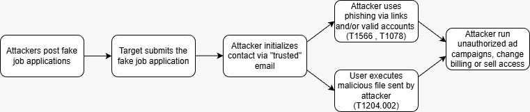

# Help Wanted: Vietnamese Actors Using Fake Job Posting Campaigns to Deliver Malware and Steal Credentials

[**https://cloud.google.com/blog/topics/threat-intelligence/vietnamese-actors-fake-job-posting-campaigns**](https://cloud.google.com/blog/topics/threat-intelligence/vietnamese-actors-fake-job-posting-campaigns)

## <u>students</u>
- Yuri Matyash
- Bar Sberro
- Sagi Pichon
- Guy Dazanshvili

## <u>Goal</u>

To trick people with fake job postings so they'll open a booby-trapped
file or log in to a fake portal, then steal their company
credentials/sessions and take over business ad/social accounts. The
point is to make money - either by running paid ads with the victim's
stolen money or by selling the stolen accounts.

## <u>Tactics, Techniques and the Behavior</u>
Here's a comprehensive list of the tactic, technique used
and the observed behavior order by the sequence of the events.

**Tactic:** Reconnaissance\
**Technique:** [T1591](https://attack.mitre.org/techniques/T1592/) - Gather Victim Host Information\
**Behavior:** Actors scan and use legitimate job platforms and public company pages to find and enumerate potential targets (posting fake job ads on those platforms and viewing profiles/job-seekers to harvest likely candidates).

**Tactic:** Resource Development\
**Technique:** [T1583](https://attack.mitre.org/techniques/T1583/) - Acquire Infrastructure\
**Behavior:** Actors register and host their own fake job sites and deploy pages to host lures and phishing kits.

**Tactic:** Resource Development\
**Technique:** [T1585.001](https://attack.mitre.org/techniques/T1585/001/) - Establish Accounts: Social Media Accounts\
**Behavior:** Actors create fake company and recruiter profiles on job platforms and LinkedIn to post openings and build credibility before contacting applicants.

**Tactic:** Initial Access\
**Technique:** [T1566.001](https://attack.mitre.org/techniques/T1566/001/) - Phishing: Spearphishing Attachment\
**Behavior:** After initial contact (from a job application), actors send a password-protected ZIP claimed to be a “skills test” or application form; victims are instructed to open/run the enclosed file, which often contains a RAT.

**Tactic:** Initial Access\
**Technique:** [T1078](https://attack.mitre.org/techniques/T1078/) - Phishing: Valid accounts\
**Behavior:** Adversaries obtain legitimate credentials or session tokens through phishing workflows (actor-hosted credential-harvesting pages, proxied MFA flows) or by convincing victims to run delivered RATs that enable credential capture. The attackers then log in with those valid credentials or stolen sessions to access corporate resources (notably advertising and social media accounts) without needing to exploit software vulnerabilities. GTIG documents credential harvesting and subsequent account takeover as a primary access vector and monetization goal.

**Tactic:** Execution\
**Technique:** [T1204.002](https://attack.mitre.org/techniques/T1204/002/) - User Execution: Malicious File\
**Behavior:** The user is tricked into running the malware themselves.
The attacker provides a ZIP archive file purporting to be a
technical assessment, and then the victim is instructed to open the file.

**Tactic:** Credential Access\
**Technique:** [T1111](https://attack.mitre.org/techniques/T1111/) - Multi-Factor Authentication Interception\
**Behavior:** Actors deliver highly convincing phishing pages or actor-hosted assessment portals that mimic legitimate corporate login and interview scheduling flows. When a target attempts to sign in, the phishing flow captures the primary credential and then presents or proxies the MFA step so the adversary can obtain a usable authenticated session.

**Tactic:** Collection\
**Technique:** [TA0009](https://attack.mitre.org/tactics/TA0009/) - Collection\
**Behavior:** The campaign collects applicant PII and application materials (names, resumes, contact details) via fake job applications and retains or sells curated lists of jobseekers; harvested credentials/session access are used to collect account data (billing, ad configurations, recovery settings) from compromised advertising/social accounts for monetization.

**Tactic:** Exfiltration\
**Technique:** [T1567](https://attack.mitre.org/techniques/T1567/) - Exfiltration Over Web Service\
**Behavior:** The campaign collects applicant PII and application materials (names, resumes, contact details) via fake job applications and retains or sells curated lists of jobseekers; harvested credentials/session access are used to collect account data (billing, ad configurations, recovery settings) from compromised advertising/social accounts for monetization.

**Tactic:** Impact\
**Technique:** [T1657](https://attack.mitre.org/techniques/T1657/) - Financial Theft\
**Behavior:** Adversaries use harvested credentials or intercepted authenticated sessions to take over corporate advertising and social-media accounts and monetize them. Concretely reported behaviours in the GTIG blog include unauthorized creation or execution of ad campaigns (draining ad budgets), changing billing/payment settings, and selling access to compromised accounts on underground markets. This direct monetization of compromised accounts constitutes financial theft from the victim organization (via unauthorized ad spend, diverted campaign revenue, or sale of account access).

## <u>End Results</u>
They managed to compromise some corporate advertising/social media accounts, get around multi-factor
authentication in some cases (by grabbing sessions/credentials), and use
those accounts to run ad campaigns or resell the access for profit. In
short: real account takeovers and direct monetization.
